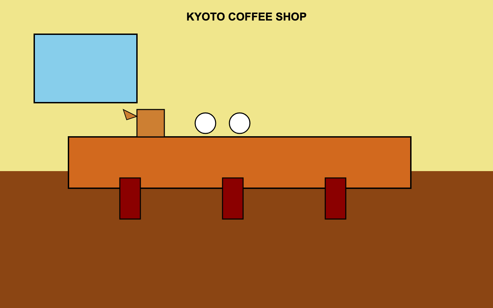
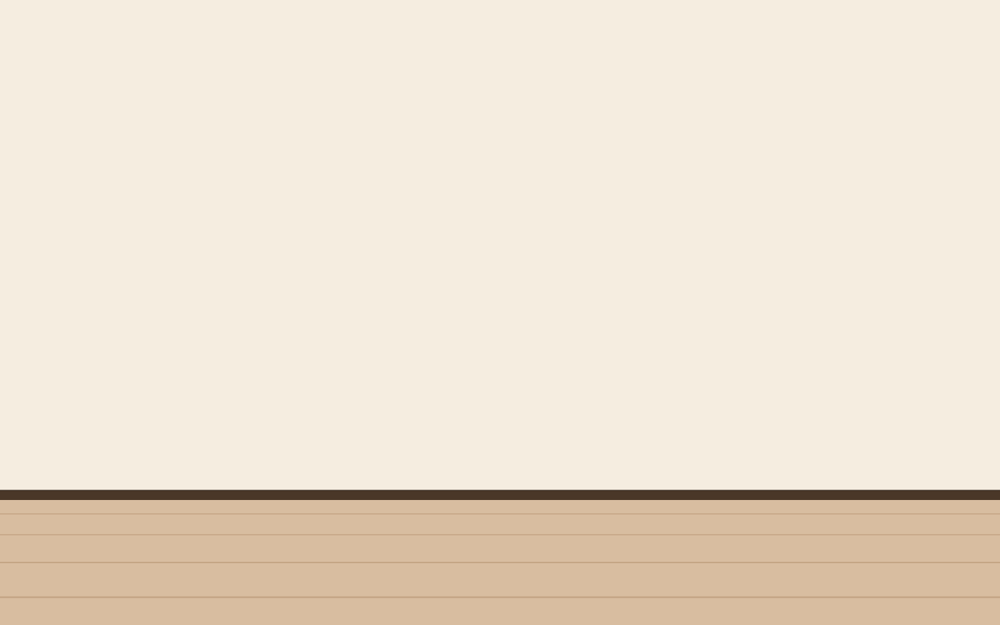
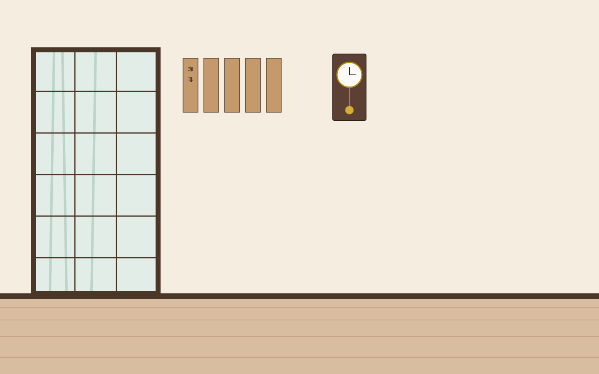
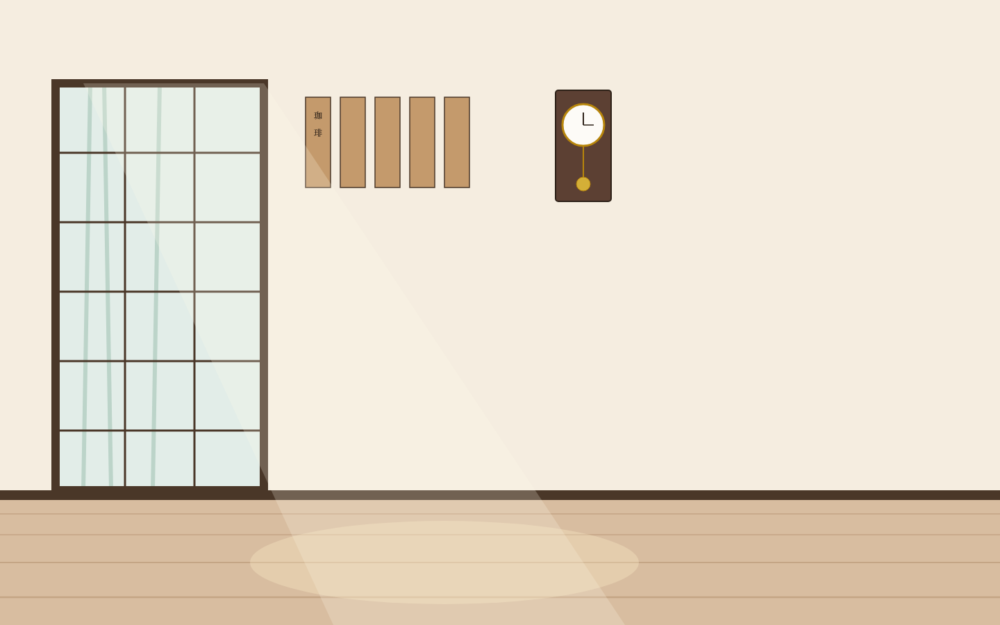
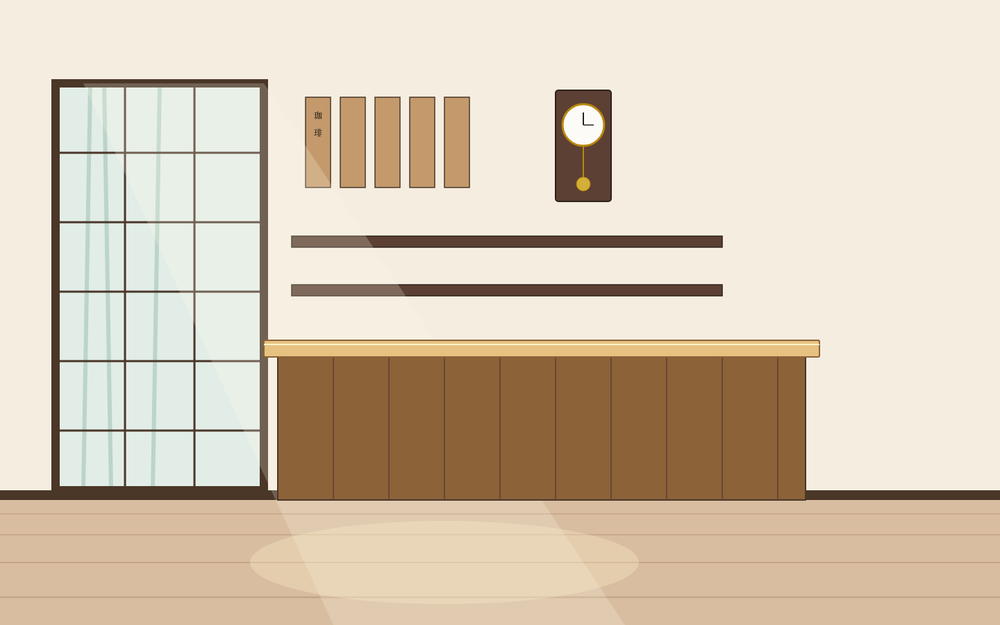
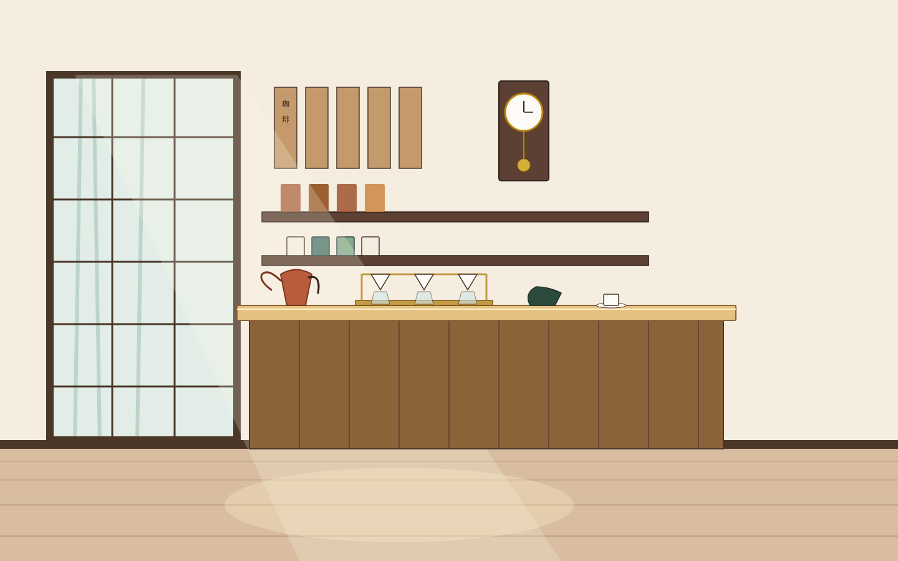
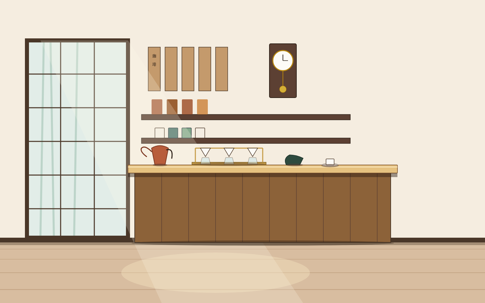
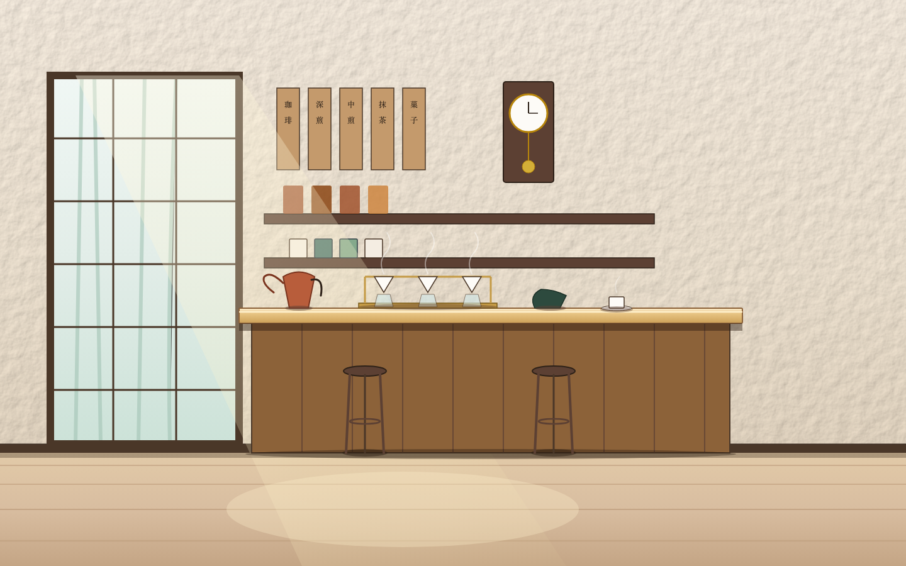

# Fun Skills: Spatial & Doodle Architects

<p align="left">
  <a href="LICENSE"></a>
  
  
  
  
</p>

> Generative SVG architectural interiors and hand-inked sketchnotes engineered through **deterministic physics evals**, **metric perspective arithmetic**, **kinematic motor curves**, and **self-improving feedback loops**.

---

## Table of Contents

- [The Core Innovation: Deterministic Evals > Vague Prompting](#the-core-innovation-deterministic-evals--vague-prompting)
- [The Showcase: One Brief, Two Architects](#the-showcase-one-brief-two-architects)
  - [1. Spatial Architect (Kyoto Kissaten)](#1-spatial-architect-kyoto-kissaten)
  - [2. Doodle Architect (Kyoto Kissaten)](#2-doodle-architect-kyoto-kissaten)
- [How to Install & Use with Your AI Agent](#how-to-install--use-with-your-ai-agent)
  - [Google Antigravity & Gemini CLI](#google-antigravity--gemini-cli)
  - [Claude Code & Claude Desktop](#claude-code--claude-desktop)
  - [Cursor, Windsurf, or Any LLM Harness](#cursor-windsurf-or-any-llm-harness)
- [Running the Deterministic Evaluation Suites](#running-the-deterministic-evaluation-suites)
- [Repository Structure](#repository-structure)
- [License](#license)

---

## The Core Innovation: Deterministic Evals > Vague Prompting

LLMs struggle with spatial reasoning, perspective foreshortening, and authentic motor kinematics when prompted naively. They generate floating clip-art, impossible lighting angles, and sterile geometric boxes.

**Fun Skills solves this by pairing generative skills with deterministic evaluation engines:**
1. **Mathematical Grounding**: Every scene begins with declared metric scales (`288px = 1m`), floor datum planes (`y = 720`), and standing camera heights ($H_{\text{cam}} = 1.65\text{m}$).
2. **Deterministic AST Evals**: The evaluation script parses the raw SVG DOM to enforce 31 non-negotiable physical laws (emitter-to-pool optics, span closures, contact shadows, collision prevention).
3. **Pixel-Tier Luminance Histograms**: Headless Chrome renders the output and verifies that shadows reach deep tones, highlights pop, and zero pure black (`#000000`) is used.
4. **Self-Improving Loops**: The agent runs the eval, receives structured programmatic error diffs, and corrects the SVG code until it reaches 0 errors.

---

## The Showcase: One Brief, Two Architects

We asked both skills to render the exact same real-world scene:
> *"Kyoto Kissaten: Gion district morning drip coffee counter with Shoji window looking out to bamboo, Hinoki bar slab, copper gooseneck kettle, triple brass V60 drip station, calligraphy menu slats, and shop cat."*

---

### 1. Spatial Architect: Kyoto Kissaten


#### 8-Shot Progression & Physics Eval Loop

| Shot | Visual State | What the Eval Pointed Out | How We Fixed It |
|---|---|---|---|
| **01** |  | **FAIL (3 errors):**<br>• `datum_declared`: Missing floor datum<br>• `scale_declared`: No metric scale<br>• `camera_height`: Ungrounded floating coordinates | Stated Stage 0 metric brief: declared `<!-- SCALE: 288px = 1m -->` and `<!-- DATUM y=720 -->` reference plane. |
| **02** |  | **FAIL (2 errors):**<br>• `room_declared`: Missing 3D room boundary<br>• `envelope_closes`: No foreshortened floor planks | Declared `<!-- ROOM: 5.00w x 6.00d x 3.12h -->`. Built Phase 1 envelope: plaster back wall (`y=0..720`), foreshortened hinoki floor (`y=720..900`), and cedar baseboard. |
| **03** |  | **WARN:**<br>• `wall_collisions`: Fixtures colliding with aperture frame<br>• Missing garden depth cue | Ordered Phase 2 Apertures before Phase 3 Fixtures. Added shoji window frame with misty bamboo silhouettes and cedar menu slats. |
| **04** |  | **ERROR `pool_shape_mismatch`:**<br>• *Window aperture projected to a round ellipse pool instead of a quadrilateral.* | Replaced ellipse with Law F3 floor-projected quadrilateral polygon: `<polygon id="sun-pool" points="380,720 900,720 1020,900 260,900" />` aligned to 34° morning sunbeam. |
| **05** |  | **ERROR `object_scale`:**<br>• *Counter height eyeballed rather than derived from metric scale.* | Derived exact 0.80m bar height ($230\text{px}$) from $288\text{px} = 1\text{m}$. Added `data-real="2.64x0.72"` to solid hinoki counter casework in Phase 5. |
| **06** |  | **WARN `density`:**<br>• Flat prop surfaces lacking Gibsonian physical affordances | Added Phase 6 artisanal pour-over gear: copper gooseneck kettle, triple brass V60 station, ceramic cones, amber bean jars, matcha chawan, and cup on saucer. |
| **07** |  | **ERROR `no_pure_black` & `floor_contact`:**<br>• Pure `#000000` black shadows<br>• Missing contact occlusion at datum | Replaced black with warm indigo `#2c1d11` and cedar `#5c4033` contact shadows beneath counter slab, along baseboard, and under props at datum `y=720`. |
| **08** |  | **PASS (0 errors, 0 warnings):**<br>• Pixel-tier histogram verified<br>• All 31 physical rules satisfied | Grounded bentwood stools on datum `y=720` (`data-real="0.24x0.45"`), added curling steam wisps, and applied zero-JS GPU architectural paper grain shader. |

---

### 2. Doodle Architect: Kyoto Kissaten


#### 8-Shot Progression & Kinematic Inking Loop

| Shot | Visual State | What the Eval Pointed Out | How We Fixed It |
|---|---|---|---|
| **01** |  | **FAIL (4 violations):**<br>• Rigid `<rect>` & `<line>` primitives<br>• Monotone `#000000` black strokes<br>• Zero motor kinematics or human hand variation | Rejected rigid primitives. Established freehand composition with organic coordinate spacing. |
| **02** |  | **WARN:**<br>• Unbalanced focal hierarchy | Formulated the visual blueprint: Shoji window left, counter slab center, equipment band, and foreground stools. |
| **03** |  | **FAIL `motor_kinematics`:**<br>• Straight polygon segments | Applied Wood et al. quadratic Bézier wrist bowing (`Q` curves with $d/L \in [0.01, 0.04]$ chord normal deflection) and corner vertex overshoots. |
| **04** |  | **FAIL `stroke_hierarchy`:**<br>• Monotone stroke weights | Enforced 3-tier hierarchy: 4.0px hero contours (shoji/counter), 2.5px props, 1.2px fine interior wood grain and texture hatching. |
| **05** |  | **FAIL `phases_ordered`:**<br>• Washes painted over ink strokes | Structured DOM into strict phases: Phase 2 watercolor washes rendered *underneath* ink lines with 3–5px deliberate misregistration. |
| **06** |  | **WARN `storytelling_density`:**<br>• Missing atmospheric life | Added curling coffee steam wisps, falling drip droplets, Kanji calligraphy slats (珈琲, 深煎, 抹茶), and sleeping cat mascot. |
| **07** |  | **WARN `typography_human`:**<br>• System sans-serif labels | Replaced with organic hand lettering, title banner with coral accent underline, and callout annotations. |
| **08** |  | **PASS (0 violations):**<br>• AST schema validated<br>• Archival paper shader rendered | Added zero-JS GPU archival cotton-rag paper texture and micro-scale stroke inking friction shader (`scale=0.8`). |

---

## How to Install & Use with Your AI Agent

### Google Antigravity & Gemini CLI

Clone this repository into your agent skills directory or symlink directly:

```bash
# Clone the skills library
git clone https://github.com/surendranb/fun-skills.git ~/skills/fun-skills

# Symlink into your Antigravity / Gemini skills folder
ln -s ~/skills/fun-skills/skills/spatial-architect ~/.gemini/antigravity/skills/spatial-architect
ln -s ~/skills/fun-skills/skills/doodle-architect ~/.gemini/antigravity/skills/doodle-architect
```

### Claude Code & Claude Desktop

Add the skills to your project root or Claude config:

```bash
# Copy into your active workspace .claude/skills directory
mkdir -p .claude/skills
cp -r ~/skills/fun-skills/skills/* .claude/skills/
```

### Cursor, Windsurf, or Any LLM Harness

Simply instruct your coding assistant to follow the prompt rules in [`skills/spatial-architect/SKILL.md`](skills/spatial-architect/SKILL.md) or [`skills/doodle-architect/SKILL.md`](skills/doodle-architect/SKILL.md).

**Prompting Example:**
> *"Using the Spatial Architect skill, generate a 1440x900 SVG interior scene for a 1970s Tokyo jazz kissa at 11:00 PM. Follow the 6-phase pipeline, declare datum at y=720, derive all casework from scale 288px=1m, and evaluate the scene with eval_scene.py."*

---

## Running the Deterministic Evaluation Suites

```bash
# 1. Evaluate Spatial SVG Scene (31 Physical AST & Pixel-Tier Checks)
python3 skills/spatial-architect/scripts/eval_scene.py examples/spatial/01-kyoto-kissaten/kyoto-kissaten.html --render

# 2. Run the 31-Rule Physics Test Suite
python3 skills/spatial-architect/scripts/test_rules.py

# 3. Evaluate Doodle SVG Sketchnote (Kinematic AST & Palette Compliance)
python3 skills/doodle-architect/scripts/eval_doodle.py examples/doodle/01-kyoto-kissaten/kyoto-kissaten-doodle.svg
```

---

## Repository Structure

```
fun-skills/
├── README.md                                # 8-Shot progression grids & eval loop documentation
├── LICENSE
├── plugin.json
├── pyproject.toml
│
├── skills/
│   ├── spatial-architect/                   # Realistic 2.5D interior scenes engine
│   │   ├── SKILL.md                         # 6-stage physical pipeline prompt
│   │   ├── references/                      # Mathematical laws (F1–F8, L1–L10) & rubric
│   │   └── scripts/                         # 52KB eval_scene.py + 31-rule test suite
│   │
│   └── doodle-architect/                    # Hand-inked sketchnotes engine
│       ├── SKILL.md                         # Motor kinematics & wrist bowing prompt
│       ├── references/                      # Kinematic formulas & watercolor shaders
│       └── scripts/                         # eval_doodle.py AST evaluator
│
└── examples/
    ├── spatial/
    │   └── 01-kyoto-kissaten/               # Master Spatial scene, 8 shots, grid & PDF
    │
    └── doodle/
        └── 01-kyoto-kissaten/               # Master Doodle scene, 8 shots, grid & PDF
```

---

## License

[MIT](LICENSE) © 2026 Surendran Balachandran
